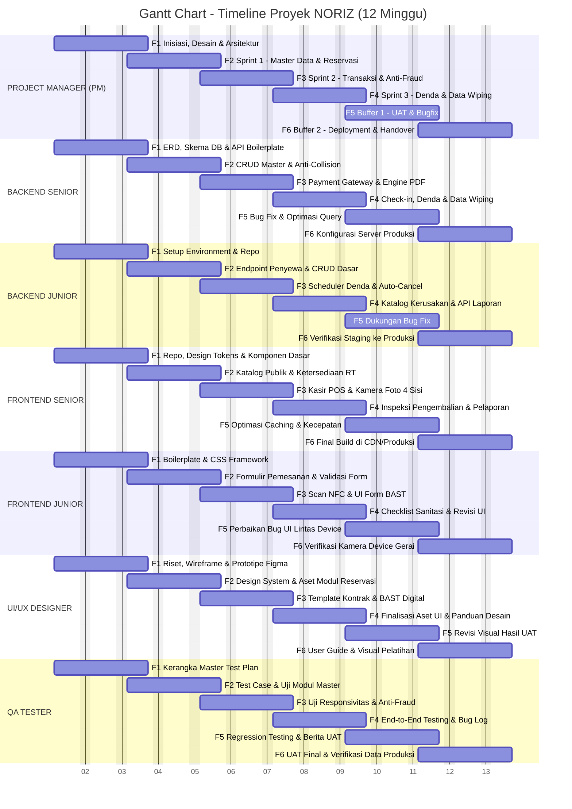

## Form Tugas MPTI

**Nama Project**
Rancang Bangun Sistem Informasi Manajemen Rental iPhone (NORIZ)

**Nama Perusahaan (Klien)**
NORIZ

**Penjelasan Tentang Project ini**
Sistem Informasi Manajemen Rental iPhone yang mengelola seluruh siklus bisnis penyewaan gawai: manajemen data master (penyewa & jaminan, katalog model & inventaris unit fisik, paket & skema tarif), transaksi gerai anti-fraud (reservasi anti-bentrok, pembayaran & kontrak digital, serah terima di gerai, pengembalian & inspeksi unit, denda overtime(jika ada), data wiping), serta pelaporan & monitoring (rekapitulasi pendapatan, utilisasi armada, logistik jaminan, blacklist).

**Nominal Budget Anggaran**
Rp 120.000.000,-

**Waktu Pengerjaan (Dalam Minggu)**
12 minggu (3 bulan) dengan strategi **2 + 1 bulan (Critical Chain Buffer)**: 8 minggu target internal tim (sprint aktif & testing) + 4 minggu buffer PM (UAT klien, bugfix, training, Go-Live).

**Deskripsi Tim Developer**
Tim **Lean Agile Team** (tim ramping berkemampuan tinggi) berjumlah 7 orang (termasuk PM), dengan skema gaji mengacu pada kisaran referensi UMK Semarang (Rp 4.000.000 – Rp 6.000.000/bln):
* **Project Manager (PM)** — Manajemen kontrak, ruang lingkup, ekspektasi klien, kontrol alur kerja harian (Daily Standup), mitigasi risiko, pengendalian timeline dan termin pembayaran.
* **Senior Backend Developer (1 orang, Rp 6 jt/bln)** — Skema database, RESTful API, business logic engine (kalkulator denda, anti-collision reservasi, validasi IMEI, modul data wiping).
* **Backend Developer (1 orang, Rp 4 jt/bln)** — Endpoint CRUD, build automation tools (scheduler denda, auto-cancel invoice), review kode, dokumentasi API.
* **Senior Frontend Developer (1 orang, Rp 6 jt/bln)** — Struktur aplikasi web responsif, modul kasir POS & kamera scan, pengawal integrasi API.
* **Frontend Developer (1 orang, Rp 4 jt/bln)** — Halaman UI, integrasi API reservasi/dashboard, optimasi caching & responsivitas.
* **UI/UX Designer (1 orang, Rp 4,5 jt/bln)** — Riset alur pengguna, wireframe & prototipe Figma, Design System, template Kontrak & BAST.
* **QA Tester (1 orang, Rp 4 jt/bln)** — Master Test Plan, test case, uji fungsional & beban, regression testing, validasi anti-fraud, Berita Acara UAT.

**Total Gaji/Upah Developer**
Rp 63.000.000,- (2 bulan kerja aktif + bonus on-time Rp 1.000.000/org):
* Senior Backend Developer: Rp 13.000.000,- (Rp 6 jt × 2 + bonus)
* Backend Developer: Rp 9.000.000,- (Rp 4 jt × 2 + bonus)
* Senior Frontend Developer: Rp 13.000.000,- (Rp 6 jt × 2 + bonus)
* Frontend Developer: Rp 9.000.000,- (Rp 4 jt × 2 + bonus)
* UI/UX Designer: Rp 10.000.000,- (Rp 4,5 jt × 2 + bonus)
* QA Tester: Rp 9.000.000,- (Rp 4 jt × 2 + bonus)

**Deskripsi Biaya2 Pendukung**
* Cloud VPS & Database Server (1 tahun pertama operasional)
* Domain bisnis & sertifikat SSL Wildcard
* Layanan third-party API: WhatsApp Gateway & Payment Gateway (Midtrans/Xendit)
* Pengadaan hardware uji gerai: USB NFC Smart Card Reader & senter UV mini
* Operasional rapat rutin tim, kuota internet koordinasi, transportasi kunjungan gerai
* Dana cadangan tak terduga (Contingency Fund ~4% total proyek)

**Budget Biaya2 Pendukung**
Rp 9.000.000,-

**Potensi Keuntungan di Project ini**
Rp 48.000.000,- (Nilai Kontrak Rp 120.000.000 − SDM Rp 63.000.000 − Biaya Pendukung Rp 9.000.000). Gross Profit Margin 40%. Rata-rata penghasilan bersih PM Rp 16.000.000,-/bulan. Jika Contingency Fund tidak terpakai, total profit maksimal Rp 51.000.000,-.

**Tabel Pekerjaan Setiap Anggota Tim dan Timeline nya**

| Fase | Minggu | Project Manager (PM) | Backend (Senior & Junior) | Frontend (Senior & Junior) | UI/UX Designer | QA Tester |
|---|---|---|---|---|---|---|
| **Fase 1: Inisiasi, Desain UI/UX & Arsitektur** | 1 – 2 | Kick-off meeting validasi spesifikasi klien, penetapan KPI tim, setup papan sprint (Trello/Jira/GitHub) | Senior: ERD & skema database PostgreSQL, boilerplate API, autentikasi JWT. Junior: setup environment & struktur repo bersama | Senior: setup repository frontend, design tokens, komponen dasar UI. Junior: setup boilerplate & CSS framework | Riset & user flow pelanggan/kasir, wireframe & prototipe Hi-Fi Figma | Review awal alur kebutuhan produk, persiapan kerangka Master Test Plan |
| **Fase 2: Sprint 1 – Master Data & Reservasi** | 3 – 4 | Daily Standup 15 menit, review termin 1 dengan klien (progres 30%) | Senior: CRUD Master Produk & Inventaris (IMEI, BH%), algoritma Anti-Collision. Junior: endpoint pendaftaran penyewa & CRUD sederhana | Senior: katalog iPhone publik + filter, indikator ketersediaan real-time. Junior: formulir pemesanan & validasi form | Finalisasi Design System untuk developer, aset UI modul reservasi | Penyusunan test case validasi KTP & reservasi, mulai uji fungsi modul master |
| **Fase 3: Sprint 2 – Transaksi Gerai & Anti-Fraud** | 5 – 6 | Pengawalan pengadaan hardware NFC & UV, kepatuhan integrasi payment gateway | Senior: integrasi payment gateway (webhook), verifikasi anti-fraud, engine PDF kontrak & BAST. Junior: scheduler auto-cancel invoice, helper integrasi | Senior: dashboard kasir POS, kamera dokumentasi foto 4 sisi. Junior: integrasi scan chip NFC & UI form BAST | Template cetak Kontrak Sewa & BAST digital | Uji responsivitas modul reservasi, validasi anti-fraud & skema pelajar |
| **Fase 4: Sprint 3 – Pengembalian, Denda & Data Wiping** | 7 – 8 | Pengumuman Internal Code Freeze (akhir M-8), evaluasi kinerja & bonus on-time tim | Senior: modul check-in & kalkulator denda, audit trail data wiping, query pelaporan. Junior: katalog biaya kerusakan sparepart & endpoint pelaporan | Senior: form inspeksi pengembalian & layar pelaporan manajerial. Junior: checklist sanitasi/reset teknisi & perbaikan UI | Finalisasi seluruh aset UI & panduan desain | End-to-End Testing (pendaftaran→denda), bug tracking log |
| **Fase 5: Buffer PM 1 – UAT & Bugfix** | 9 – 10 | Sesi UAT resmi dengan klien, kontrol scope creep, pemanfaatan buffer perbaikan | Senior: bug fix hasil UAT & optimasi query. Junior: pembuatan laporkan bug & dukungan perbaikan kecil | Senior: optimasi caching & kecepatan muat halaman. Junior: perbaikan bug UI lintas perangkat | Dukungan revisi visual hasil temuan UAT | Regression testing tiap bug, penyusunan Berita Acara UAT |
| **Fase 6: Buffer PM 2 – Deployment, Training & Handover** | 11 – 12 | Migrasi ke server produksi, Go-Live, penandatanganan BAST proyek akhir, penagihan pelunasan 100% & distribusi bonus | Senior: konfigurasi server produksi, domain, SSL HTTPS, auto-backup. Junior: verifikasi environment staging→produksi | Senior: final build & bundle di CDN/produksi. Junior: verifikasi kamera & perangkat device gerai | Finalisasi user guide & dukungan visual pelatihan | Pendampingan UAT final, verifikasi data produksi & handover dokumen |

### Gantt Chart Timeline Proyek (12 Minggu)

