# DOKUMEN SPESIFIKASI ATURAN DAN PROSES BISNIS
# SISTEM INFORMASI MANAJEMEN RENTAL IPHONE (NORIZ)

**Mata Kuliah:** Manajemen Proyek Teknologi Informasi  
**Topik Proyek:** Perancangan Sistem Informasi Manajemen Layanan Rental iPhone  
**Penyusun:** Mahasiswa Teknik Informatika (NIM: A11.2025.16609)  

---

## PENDAHULUAN & RUANG LINGKUP SISTEM

Sistem Informasi Manajemen Rental iPhone (**NORIZ**) adalah sistem informasi operasional yang dirancang untuk mengelola keseluruhan siklus bisnis penyewaan gawai (iPhone), mencakup tata kelola data master penyewa, verifikasi identitas, manajemen fisik unit (eksemplar armada), skema paket sewa, transaksi reservasi, serah terima unit, pengembalian dan inspeksi kondisi, perhitungan denda serta ganti rugi, hingga kepatuhan privasi data (*data wiping*).

Dokumen ini mendefinisikan spesifikasi formal mengenai **Aturan Bisnis (*Business Rules*)** dan **Alur Proses Bisnis (*Business Process Flow*)** sebagai acuan teknis dalam pengembangan fungsionalitas sistem informasi.

### Peta Arsitektur & Dekomposisi Modul Sistem

```mermaid
flowchart TD
    subgraph Core ["SISTEM INFORMASI MANAJEMEN RENTAL IPHONE (NORIZ)"]
        direction TB
        subgraph P1 ["BAB 1: MANAJEMEN DATA MASTER"]
            direction TB
            M1["1. Penyewa, Verifikasi & Jaminan"]
            M2["2. Katalog Model & Inventaris Unit Fisik"]
            M3["3. Paket Sewa & Skema Tarif"]
        end

        subgraph P2 ["BAB 2: MANAJEMEN TRANSAKSI"]
            direction TB
            T1["1. Reservasi & Jadwal Unit"]
            T2["2. Pembayaran & Kontrak Digital"]
            T3["3. Serah Terima di Gerai (In-Store)"]
            T4["4. Pengembalian & Inspeksi Unit"]
            T5["5. Denda Overtime & Ganti Rugi"]
            T6["6. Pembersihan Data (Data Wiping)"]
        end

        subgraph P3 ["BAB 3: PELAPORAN & MONITORING"]
            direction TB
            R1["1. Rekap Pendapatan & Kas"]
            R2["2. Utilisasi & Kesehatan Armada"]
            R3["3. Tracking Jaminan & Blacklist"]
        end
    end
```

#### Ringkasan Tanggung Jawab Modul

| Pilar Arsitektur | Modul Fungsional | Fokus & Tanggung Jawab Utama |
|---|---|---|
| **BAB 1: DATA MASTER** | **1. Penyewa, Verifikasi & Jaminan** | Profil penyewa, anti-fraud KTP/KK, skema pelajar, dan manajemen loker jaminan fisik. |
| | **2. Katalog & Unit Fisik Armada** | Master model iPhone, pelacakan fisik per IMEI/Serial, kondisi baterai (*BH*), dan status siklus unit. |
| | **3. Paket & Skema Tarif** | Paket durasi (12j/24j/3h/7h), tarif sewa, formula denda *overtime*, dan deposit jaminan. |
| **BAB 2: TRANSAKSI** | **1. Reservasi & Jadwal Unit** | Cek ketersediaan tanpa tabrakan jadwal (*anti-collision*), *buffer time* 2 jam, dan batas kedaluwarsa tagihan. |
| | **2. Pembayaran & Kontrak Digital** | Multi-channel payment, konfirmasi lunas, dan penerbitan kontrak sewa digital mengikat. |
| | **3. Serah Terima di Gerai** | Validasi fisik langsung di gerai (*in-store only*), uji NFC/UV, baseline BAST fisik, dan kunci unit. |
| | **4. Pengembalian & Inspeksi** | Verifikasi keaslian IMEI, wajib logout Apple ID & matikan *Find My*, serta komparasi kondisi baseline. |
| | **5. Denda & Ganti Rugi** | Kalkulasi denda overtime otomatis, tabel biaya kerusakan sparepart, total loss, dan penahanan jaminan. |
| | **6. Pembersihan Data (*Wiping*)** | Eksekusi *factory reset* (sanitasi data pribadi), pengisian baterai $\ge 80\%$, dan rilis unit kembali ke inventaris. |
| **BAB 3: MONITORING** | **1. Pelaporan & Analisis** | Laporan omzet/pendapatan, utilisasi unit terpopuler, kesehatan baterai armada, log jaminan, dan daftar hitam. |

---

## BAB 1: MANAJEMEN DATA MASTER

### 1. Modul Pendaftaran, Verifikasi Penyewa & Manajemen Jaminan
Modul ini mengatur siklus hidup data penyewa, validasi kelayakan kredit/risiko identitas, serta mekanisme pencatatan dan penyimpanan dokumen fisik jaminan.

#### A. Aturan Bisnis (Business Rules)
* **Unique Customer ID:** Setiap penyewa yang terdaftar wajib memiliki ID Penyewa unik yang diterbitkan secara otomatis oleh sistem (misal: `CUST-2026-0001`).
* **Validasi Kontak & Identitas Utama:** Penyewa wajib melampirkan nomor WhatsApp aktif, alamat email valid, alamat domisili lengkap, serta nomor identitas resmi (NIK KTP).
* **Kategori Penyewa & Kebijakan Dokumen Jaminan:** Untuk memitigasi risiko penggelapan unit, penyewa diklasifikasikan ke dalam kategori dengan ketentuan jaminan wajib:
  - **Mahasiswa:** Wajib menitipkan KTP asli + Kartu Tanda Mahasiswa (KTM) aktif + akun media sosial aktif.
  - **Karyawan/Pekerja:** Wajib menitipkan KTP asli + Kartu Karyawan / Surat Keterangan Kerja / ID Perusahaan.
  - **Umum / Wisatawan:** Wajib menitipkan KTP asli + 1 dokumen sekunder asli (SIM / NPWP / Kartu BPJS / Paspor) + deposit finansial bila dinilai perlu oleh sistem analisis risiko.
  - **Pelajar / Remaja (< 17 Tahun / Belum Memiliki e-KTP Pribadi):** Mengingat anak di bawah umur belum cakap hukum untuk menandatangani kontrak perdata secara mandiri, berlaku **Skema Penjaminan Orang Tua/Wali (*Parental Guarantor Scheme*)**:
    1. *Penanggung Jawab Kontrak:* Kontrak sewa dan penjaminan hukum penuh diatasnamakan Orang Tua atau Wali sah.
    2. *Dokumen Jaminan Fisik Wajib:* Menitipkan e-KTP Asli Orang Tua/Wali + Kartu Pelajar aktif / Kartu Identitas Anak (KIA).
    3. *Bukti Hubungan Keluarga:* Wajib melampirkan Kartu Keluarga (KK) asli untuk memverifikasi keselarasan nama orang tua dengan nama pelajar.
    4. *Konfirmasi Dua Arah (Parental Confirmation):* Petugas sistem wajib melakukan verifikasi langsung (via panggilan telepon atau video call) ke nomor orang tua yang tertera di formulir sebelum persetujuan sewa diberikan.
    5. *Sumber Pembayaran:* Pembayaran wajib berasal dari rekening bank/e-wallet atas nama orang tua atau atas nama pelajar yang namanya terdaftar dalam Kartu Keluarga yang sama.
* **Prosedur Ketat Anti-Fraud KTP Fisik & Verifikasi Identitas:**
  - **Uji Keberadaan Chip e-KTP (NFC Hardware Check):** Petugas wajib memindai fisik e-KTP penyewa (atau orang tua untuk kategori pelajar) menggunakan perangkat pembaca NFC. KTP asli Kemendagri wajib merespons keberadaan chip RFID terenkripsi. KTP palsu hasil cetak percetakan abal-abal/kertas laminasi yang tidak memiliki respons chip otomatis **DITOLAK**.
  - **Uji Fisik & Sinar Ultraviolet (UV Light Inspection):** Petugas wajib memeriksa fisik kartu berbahan kaku *polycarbonate* serta memvalidasi pendaran hologram lambang Garuda dan serat mikro (*invisible ink*) di bawah senter sinar UV.
  - **Kebijakan Keselarasan Rekening Finansial (1-to-1 Match Policy):** Pembayaran sewa dan deposit WAJIB ditransfer dari rekening bank atau akun e-wallet atas nama yang sama persis dengan nama pada KTP (atau nama orang tua pada KK untuk pelajar). Sistem melarang keras pembayaran dari rekening pihak ketiga yang tidak terafiliasi guna mencegah penggunaan KTP curian/temuan.
  - **Kewajiban Dokumen Pembanding (Multi-Document Rule):** KTP asli wajib didampingi minimal 1 dokumen identitas resmi lain (SIM, Paspor, BPJS, KK, atau KTM) dengan nama, NIK, dan tanggal lahir yang konsisten.
  - **Uji Biometrik Wajah (Liveness Detection):** Registrasi pada aplikasi mewajibkan swafoto (*selfie*) dengan deteksi gerakan acak (kedip/senyum) untuk dicocokkan dengan foto fisik KTP dan wajah penyewa saat serah terima.
* **Manajemen Fisik Dokumen Jaminan (Tracking Jaminan):** 
  - Sistem tidak menyimpan fisik kartu di database, melainkan mencatat metadata pelacakan: *Jenis Dokumen*, *Nomor Seri Dokumen*, *Nama Pemilik Dokumen*, *Hubungan Keluarga (jika Pelajar)*, *Tanggal Diterima*, *Petugas Penerima*, serta *Kode Slot/Loker Penyimpanan Fisik* (misal: `BRANKAS-LOKER-B04`).
  - Dokumen jaminan fisik wajib berada di dalam penguasaan rental selama periode sewa berlangsung dan berstatus `Disimpan Dalam Loker`.
* **Status Akun Penyewa:** Akun penyewa memiliki 4 status logis:
  - `Menunggu Verifikasi`: Akun baru dibuat, data belum divalidasi petugas.
  - `Terverifikasi`: Akun telah lolos validasi dokumen dan memiliki hak untuk menyewa unit.
  - `Ditangguhkan (Suspended / Blacklist)`: Akun dibekukan akibat keterlambatan pengembalian belum lunas, denda kerusakan belum diselesaikan, atau indikasi pemalsuan data.
  - `Non-Aktif`: Akun ditutup atas permintaan pengguna atau tidak aktif selama lebih dari 12 bulan berturut-turut.

#### B. Alur Proses Bisnis
1. **Registrasi Akun:** Calon penyewa mendaftarkan akun di sistem NORIZ. Untuk kategori pelajar, data profil dilengkapi dengan data penjamin (nama orang tua/wali, NIK orang tua, dan nomor telepon orang tua).
2. **Unggah Berkas & Validasi Digital:** Penyewa mengunggah foto KTP (atau KTP orang tua + KK + Kartu Pelajar untuk kategori pelajar) serta melakukan swafoto biometrik (*liveness check*). Untuk pelajar, petugas melakukan panggilan konfirmasi langsung ke orang tua.
3. **Pemeriksaan Fisik Anti-Fraud di Gerai:** Penyewa wajib hadir langsung ke gerai fisik rental (tidak dapat diwakilkan atau via kurir). Petugas melakukan uji fisik kartu: *scan* chip NFC pada e-KTP, sorot sinar UV pada hologram, dan pencocokan wajah langsung.
4. **Verifikasi Rekening Pembayaran:** Petugas/sistem memvalidasi bahwa bukti transfer sewa berasal dari rekening yang selaras dengan data KTP/KK terdaftar.
5. **Penyimpanan Jaminan & Aktivasi Akun:** Petugas menginput kode loker penyimpanan fisik ke dalam sistem, mencetak Tanda Terima Jaminan digital, dan status akun resmi menjadi `Terverifikasi`.

---

### 2. Modul Manajemen Katalog Model & Inventaris Unit iPhone
Modul ini mengatur katalog spesifikasi umum perangkat serta pengelolaan individual unit fisik iPhone (inventaris armada).

#### A. Aturan Bisnis (Business Rules)
* **Pemisahan Katalog vs Unit Fisik Eksemplar:**
  - **Katalog Produk (Master Model):** Berisi entitas tipe/spesifikasi umum (contoh: *iPhone 15 Pro 256GB Natural Titanium*).
  - **Unit Fisik (Armada Eksemplar):** Setiap unit fisik fisik di lapangan memiliki identitas individual yang wajib dicatat: *Kode Unit Fisik* (misal: `IP15P-001`), *Nomor Serial (Serial Number)*, *IMEI 1*, *IMEI 2*, dan *Warna*.
* **Parameter Kesehatan & Kondisi Unit:** Setiap unit fisik wajib memiliki riwayat kondisi yang diperbarui setiap siklus sewa:
  - Persentase kesehatan baterai (*Battery Health* / BH %).
  - Kondisi fisik layar, *casing*, dan modul kamera (*Grade A: Mulus, Grade B: Lecet Pemakaian Minor, Grade C: Baret Kasat Mata*).
  - Status fungsi fitur perangkat (*Face ID, True Tone, Speaker, Mikrofon, Kamera Depan/Belakang, Port Charging, Tombol Fisik*).
  - Kelengkapan aksesori bawaan (*Kepala Adaptor Charger Asli, Kabel Type-C/Lightning, Pelindung Layar Terpasang, Casing Unit, Pouch Box*).
* **Status Siklus Unit Fisik:** Setiap unit hanya dapat memiliki salah satu dari 6 status sistematis:
  - `Tersedia`: Unit siap disewa dan berada di ruang penyimpanan inventaris.
  - `Dipesan`: Unit telah dikunci untuk reservasi penyewa pada tanggal tertentu.
  - `Disewa`: Unit sedang berada di tangan penyewa aktif.
  - `Menunggu Pemeriksaan & Reset`: Unit baru saja dikembalikan dan menunggu proses inspeksi serta *data wiping*.
  - `Dalam Perbaikan (Maintenance)`: Unit sedang dalam perbaikan teknis atau penggantian suku cadang.
  - `Afkir / Hilang (Written-off / Lost)`: Unit rusak total atau dilaporkan hilang dalam penanganan hukum.
* **Batas Kelaikan Operasional:** Unit dengan *Battery Health* di bawah 80% atau memiliki kecacatan fungsi layar wajib otomatis berpindah ke status `Dalam Perbaikan` dan tidak dapat dipilih dalam transaksi sewa baru.

#### B. Alur Proses Bisnis
1. **Pencatatan Master Model:** Petugas menginput spesifikasi seri iPhone baru (Model, Kapasitas, Warna, Fitur Dasar) ke katalog sistem.
2. **Pendaftaran Unit Armada Baru (Stock In):** Petugas menginput data unit fisik yang baru dibeli: nomor seri, IMEI 1, IMEI 2, tanggal perolehan, harga beli awal, serta mencetak stiker QR Code unik berisi Kode Unit.
3. **Perekaman Kondisi Awal (Baseline Setup):** Petugas menginput kondisi awal (BH 100%, kondisi mulus, kelengkapan aksesori lengkap) dan menempelkan QR Code pada unit.
4. **Penempatan & Aktivasi Status:** Petugas menaruh unit pada rak penyimpanan inventaris. Status unit disetel menjadi `Tersedia`.

---

### 3. Modul Paket & Skema Tarif Sewa
Modul ini mengatur konfigurasi durasi sewa, skema tarif dinamis, deposit finansial, serta formula denda keterlambatan (*overtime*).

#### A. Aturan Bisnis (Business Rules)
* **Standarisasi Paket Durasi:** Sistem menyediakan durasi sewa terstruktur:
  - Paket 12 Jam (Pilihan *short event* / pemotretan singkat).
  - Paket 24 Jam (Paket standar 1 hari).
  - Paket 3 Hari (Paket liburan akhir pekan / *short trip*).
  - Paket 7 Hari (Paket mingguan).
* **Matriks Tarif Sewa:** Nilai sewa pokok dihitung berdasarkan rumus kombinasi:
  $$\text{Biaya Sewa Pokok} = f(\text{Model iPhone}, \text{Kapasitas Memori}, \text{Paket Durasi})$$
* **Aturan Denda Overtime (Keterlambatan):**
  - **Tarif Overtime per Jam:** Ditetapkan flat per jam sesuai tipe model perangkat (misal: iPhone 13 = Rp15.000/jam, iPhone 15 Pro = Rp30.000/jam).
  - **Grace Period (Toleransi Waktu):** Keterlambatan $\le 15$ menit dari jam jatuh tempo tidak dikenakan biaya denda (*grace period*).
  - **Pembulatan Jam Keterlambatan:** Keterlambatan lebih dari 15 menit dibulatkan ke atas menjadi 1 jam penuh.
  - **Keterlambatan Ekstrem:** Keterlambatan melebihi 6 jam berturut-turut tanpa konfirmasi perpanjangan sewa resmi otomatis dihitung denda sewa 1 hari penuh ditambah denda penalti administratif sebesar 50% dari sewa harian.
* **Deposit Finansial (Opsional):** Bagi pengguna baru atau penyewa luar kota, sistem dapat mewajibkan deposit tunai/transfer (dikembalikan penuh setelah unit kembali dalam kondisi baik).

#### B. Alur Proses Bisnis
1. **Konfigurasi Master Paket:** Administrator menentukan jenis paket durasi dan batas waktu pengembalian standar.
2. **Penetapan Matriks Harga:** Administrator menginput matriks harga sewa untuk masing-masing model iPhone dan kapasitas memori.
3. **Pengaturan Parameter Overtime:** Administrator memasukkan nominal tarif overtime per jam dan menetapkan batas toleransi menit keterlambatan.
4. **Pembaruan Katalog Publik:** Sistem memublikasikan tarif aktif ke antarmuka katalog pemesanan.

---

## BAB 2: MANAJEMEN TRANSAKSI

### 1. Modul Reservasi & Ketersediaan Jadwal Unit
Modul ini mengelola proses pemesanan awal, penjadwalan unit fisik, dan pencegahan bentrok jadwal pemakaian.

#### A. Aturan Bisnis (Business Rules)
* **Unique Reservation Code:** Setiap pemesanan memiliki kode transaksi unik (contoh: `RSV-202609-0012`).
* **Pencegahan Bentrok Jadwal (Anti-Collision Algorithm):** Satu unit fisik tidak dapat dipesan oleh 2 penyewa berbeda pada rentang waktu yang sama atau bersinggungan.
* **Jeda Pembersihan (Buffer Time):** Sistem wajib menyisipkan *buffer time* minimal 2 jam di antara akhir sewa penyewa A dan awal sewa penyewa B untuk proses pemeriksaan, pembersihan, sanitasi, dan *data wiping*.
* **Prasyarat Status Akun:** Hanya akun penyewa dengan status `Terverifikasi` yang dapat memproses transaksi reservasi.
* **Batas Waktu Pembayaran (Hold Timeout):** Pemesanan yang baru dibuat berstatus `Menunggu Pembayaran` memiliki batas kedaluwarsa pembayaran 60 menit. Jika tidak diselesaikan dalam 60 menit, sistem membatalkan reservasi secara otomatis dan mengembalikan unit ke status `Tersedia`.
* **Batas Kuota Pemesanan:** Satu akun penyewa perorangan hanya diizinkan memiliki maksimal 1 transaksi penyewaan aktif pada satu waktu (kecuali penyewa korporat/event dengan persetujuan khusus manajer).

#### B. Alur Proses Bisnis
1. **Pemilihan Unit & Durasi:** Penyewa memilih model iPhone, menentukan jam jadwal pengambilan di gerai (*store pickup*), serta menetapkan paket durasi sewa.
2. **Pengecekan Ketersediaan:** Sistem melakukan pengecekan ketersediaan unit fisik pada rentang tanggal tersebut. Jika tersedia, sistem melakukan penguncian sementara (*temporary hold*) terhadap unit fisik yang dipilih.
3. **Penerbitan Rincian Tagihan (Invoice):** Sistem menghitung total biaya sewa pokok dan deposit (jika ada), lalu menerbitkan tagihan dengan batas waktu pembayaran.
4. **Penguncian Unit (Booking Confirmed):** Setelah pembayaran terverifikasi, status pemesanan berubah menjadi `Terkonfirmasi`, dan status unit fisik berubah menjadi `Dipesan`.

---

### 2. Modul Pembayaran & Kontrak Sewa Digital
Modul ini mengelola verifikasi finansial dan penerbitan kontrak hukum perjanjian sewa secara digital.

#### A. Aturan Bisnis (Business Rules)
* **Kanal Pembayaran Terdaftar:** Sistem mendukung metode pembayaran resmi: Transfer Virtual Account, QRIS Dinamis, dan Tunai di Kasir Gerai.
* **Status Pembayaran:** Status pembayaran tercatat secara ketat:
  - `Belum Dibayar`
  - `Menunggu Konfirmasi / Verifikasi`
  - `Lunas`
  - `Dibatalkan / Kedaluwarsa`
  - `Dikembalikan (Refunded)`
* **Penerbitan Kontrak Sewa Digital:** Sistem secara otomatis menghasilkan dokumen Kontrak Perjanjian Sewa Digital berisikan:
  - Identitas pihak pertama (Rental) dan pihak kedua (Penyewa, serta Orang Tua/Wali sebagai Penjamin Sah bila penyewa berkategori Pelajar).
  - Rincian unit lengkap dengan nomor IMEI dan nilai taksiran ganti rugi unit.
  - Klausul hak dan larangan: larangan menggadaikan unit, larangan membongkar baut perangkat, kewajiban me-logout akun iCloud sebelum pengembalian, dan tabel tanggung jawab kerusakan.
* **Keabsahan Kontrak Digital:** Penyewa (atau Orang Tua/Wali sah bagi kategori Pelajar) wajib menandatangani kontrak secara digital (tanda tangan elektronik / verifikasi OTP) sebelum serah terima fisik dapat dieksekusi.

#### B. Alur Proses Bisnis
1. **Pembayaran Tagihan:** Penyewa melakukan pembayaran melalui kanal yang tersedia sesuai nominal pada invoice.
2. **Verifikasi Finansial:** Sistem payment gateway (atau kasir) memvalidasi transaksi dan mengubah status invoice menjadi `Lunas`.
3. **Generate Kontrak Digital:** Sistem menghasilkan draf kontrak sewa berisi klausul hukum dan data rincian unit yang disewa.
4. **Persetujuan & Tanda Tangan Digital:** Penyewa membaca dan menandatangani kontrak digital di sistem. Kontrak tersimpan permanen dalam riwayat transaksi akun.

---

### 3. Modul Serah Terima Unit di Gerai (In-Store Handover) & Baseline Kondisi
Modul ini mengatur penyerahan fisik unit dari pihak rental kepada penyewa, validasi dokumen jaminan fisik, serta dokumentasi kondisi awal perangkat secara tatap muka di gerai.

#### A. Aturan Bisnis (Business Rules)
* **Kewajiban Kehadiran Fisik Langsung (In-Person Presence Only / No Delivery):**
  - Pengambilan unit dan penyerahan jaminan fisik **WAJIB dilakukan langsung oleh penyewa terdaftar di gerai fisik rental** (tidak melayani pengantaran via kurir/ojek online atau perwakilan kuasa pihak ketiga).
  - Kebijakan ini demi menjamin keabsahan uji fisik KTP asli menggunakan alat *NFC Reader* & lampu UV di konter gerai, memastikan keamanan penyimpanan KTP langsung ke brankas loker, serta terekam kamera CCTV gerai rental.
* **Kondisi Prasyarat Serah Terima:** Serah terima unit HANYA BOLEH dilakukan apabila:
  1. Status pembayaran telah `Lunas`.
  2. Kontrak sewa digital telah ditandatangani oleh penyewa.
  3. Dokumen fisik jaminan asli telah diserahkan, diuji keasliannya, dan dicatat nomor lokernya di dalam sistem.
* **Dokumentasi Baseline Kondisi Awal (Checklist Serah Terima):** Petugas dan penyewa wajib melakukan inspeksi bersama di meja konter gerai, mencakup:
  - Persentase awal *Battery Health*.
  - Foto fisik unit tampak depan, belakang, dan sisi samping (diunggah ke sistem).
  - Pengecekan kelengkapan: kabel data, adaptor, casing pelindung, dan box.
  - Pembuktian bahwa perangkat dalam kondisi tidak terhubung ke akun iCloud manapun saat diserahkan.
* **Aktivasi Masa Sewa:** Waktu masa sewa resmi berjalan sejak tombol `Serah Terima Selesai` ditekan oleh petugas pada sistem, dan status unit fisik berubah menjadi `Disewa`.

#### B. Alur Proses Bisnis
1. **Kedatangan Penyewa di Gerai:** Penyewa hadir langsung di gerai rental sesuai jadwal reservasi dengan membawa dokumen jaminan fisik asli.
2. **Uji Keaslian & Penyimpanan Jaminan Fisik:** Petugas menguji keaslian e-KTP dengan alat pembaca NFC dan lampu UV, menempatkan dokumen di brankas loker, dan mencatat nomor slot loker ke dalam sistem.
3. **Pemeriksaan Bersama Kondisi Awal:** Petugas membuka form serah terima pada sistem, mendokumentasikan kondisi unit (foto fisik, cek fungsi tombol, kamera, Face ID, dan BH %), lalu disetujui bersama penyewa.
4. **Penerbitan Berita Acara Serah Terima (BAST):** Petugas dan penyewa menyetujui BAST digital di sistem.
5. **Penyerahan Unit:** iPhone beserta kelengkapannya diserahkan kepada penyewa. Sistem memperbarui status transaksi menjadi `Sedang Berjalan (Active Rental)` dan status unit menjadi `Disewa`.

---

### 4. Modul Pengembalian Unit & Inspeksi Kondisi (Check-In)
Modul ini mengatur proses penerimaan kembali perangkat sewa, verifikasi keaslian perangkat, dan inspeksi fisik/fungsi komprehensif.

#### A. Aturan Bisnis (Business Rules)
* **Verifikasi Integritas Perangkat (Anti-Switching):** Petugas wajib memindai QR Code/Barcode unit dan mencocokkan IMEI fisik serta nomor seri pada menu pengaturan iPhone dengan nomor IMEI yang tertera pada kontrak sewa digital untuk memastikan unit tidak ditukar.
* **Kewajiban Pelepasan Akun iCloud & Activation Lock:**
  - Penyewa WAJIB melakukan logout dari akun Apple ID / iCloud pribadi di depan petugas.
  - Fitur *Find My iPhone* dan *Activation Lock* wajib dipastikan berstatus NON-AKTIF (*OFF*).
  - Jika penyewa menolak atau lupa kata sandi iCloud sehingga *Activation Lock* tertinggal, transaksi pengembalian DITOLAK, masa sewa tetap dihitung berjalan (terkena akumulasi overtime harian), dan jaminan ditahan sampai akun berhasil dilepas.
* **Pemeriksaan Komparatif Terhadap Baseline:** Petugas mencocokkan kondisi fisik unit saat kembali dengan foto dokumentasi awal pada BAST Serah Terima (memeriksa ada/tidaknya goresan baru, retak layar, tombol macet, atau penurunan fungsi).
* **Pelepasan Dokumen Jaminan:** Dokumen fisik jaminan HANYA DAPAT DIKEMBALIKAN kepada penyewa apabila:
  1. Unit telah diterima fisik dan lolos verifikasi IMEI.
  2. Akun iCloud telah dilepas secara sempurna.
  3. Tidak ada tunggakan overtime maupun denda kerusakan (atau seluruh denda telah dibayar lunas di kasir).

#### B. Alur Proses Bisnis
1. **Penyerahan Kembali Unit:** Penyewa mengembalikan iPhone dan kelengkapan aksesori ke petugas gerai rental.
2. **Verifikasi Identitas Unit:** Petugas memindai nomor seri/IMEI unit dan mencocokkannya dengan database transaksi di sistem.
3. **Pelepasan Apple ID & Find My:** Penyewa me-logout akun Apple ID di depan petugas, dan petugas memverifikasi bahwa *Activation Lock* telah non-aktif.
4. **Inspeksi Fisik & Fungsi (Form Check-In):** Petugas mengisi formulir inspeksi digital pada sistem, membandingkan kondisi dengan baseline awal, dan memeriksa kelengkapan aksesori.
5. **Penentuan Status Pengembalian:**
   - **Kondisi Normal & Tepat Waktu:** Sistem menutup masa sewa, mengubah status unit menjadi `Menunggu Pemeriksaan & Reset`, dan mengizinkan pengembalian dokumen jaminan.
   - **Ada Masalah (Terlambat / Kerusakan):** Sistem meneruskan transaksi ke Modul Denda & Ganti Rugi.

---

### 5. Modul Denda Overtime, Kerusakan, & Ganti Rugi
Modul ini mengatur kalkulasi finansial otomatis atas keterlambatan, kerusakan fisik, kehilangan komponen, maupun kerugian total unit.

#### A. Aturan Bisnis (Business Rules)
* **Kalkulasi Denda Keterlambatan Otomatis:**
  $$\text{Denda Overtime} = \lceil\text{Jam Keterlambat}\rceil \times \text{Tarif Overtime/Jam}$$
  *(dengan ketentuan selisih waktu di luar batas toleransi 15 menit).*
* **Tabel Standar Kerusakan Fisik & Aksesori:** Nilai ganti rugi kerusakan dihitung berdasarkan katalog biaya pemulihan yang ditetapkan manajemen:
  - *Lecet bodi baru / baret minor:* Biaya kompensasi penyusutan (Rp50.000 - Rp100.000).
  - *Layar retak / pecah (LCD & Digitizer):* Biaya penggantian layar resmi sesuai tipe model + biaya administrasi penanganan Rp50.000.
  - *Kamera retak / pecah modul:* Biaya penggantian modul kamera resmi + biaya administrasi.
  - *Back glass retak:* Biaya perbaikan back glass sesuai tipe unit.
  - *Kabel USB-C / Lightning hilang atau putus:* Denda penggantian aksesori asli (Rp150.000).
  - *Kepala Adaptor Charger hilang / rusak:* Denda penggantian adaptor resmi (Rp350.000).
* **Ganti Rugi Kehilangan Unit (Total Loss / Penggelapan):**
  - Jika unit hilang, penyewa wajib membayar ganti rugi sebesar:
    $$\text{Biaya Penggantian} = \text{Nilai Pasar Wajar Unit Sejenis} + \text{Biaya Disrupsi Operasional (10\%)}$$
  - Penyewa diberikan tenggat waktu penyelesaian maksimal $3 \times 24$ jam sebelum kasus dilimpahkan ke jalur hukum menggunakan dokumen identitas jaminan sebagai bukti tindak pidana.
* **Penahanan Dokumen Jaminan & Blacklist:** Selama tagihan denda belum lunas, dokumen jaminan fisik tetap tersimpan di brankas loker, dan akun penyewa otomatis berstatus `Ditangguhkan (Suspended)`.

#### B. Alur Proses Bisnis
1. **Pendeteksian Pelanggaran:** Sistem mendeteksi keterlambatan waktu pengembalian secara otomatis, dan/atau petugas menandai temuan kerusakan pada lembar inspeksi *check-in*.
2. **Kalkulasi Total Denda:** Sistem merekap seluruh tagihan penalti (Denda Overtime + Denda Kerusakan Fisik + Denda Kehilangan Aksesori) ke dalam lembar tagihan penyelesaian (*Settlement Invoice*).
3. **Pembayaran Denda:** Penyewa melunasi tagihan denda di kasir (tunai/transfer).
4. **Pencatatan Pelunasan:** Petugas menginput konfirmasi bayar pada sistem. Sistem mengubah status invoice denda menjadi `Lunas`.
5. **Pengambilan Dokumen Jaminan Fisik:** Petugas mengambil dokumen jaminan dari brankas loker, menyerahkannya kembali ke penyewa, dan menutup transaksi secara permanen.

---

### 6. Modul Pembersihan Data (Privacy Data Wiping) & Release Unit
Modul ini mengatur prosedur sterilisasi privasi data penyewa dan penyiapan unit agar aman untuk disewakan kembali ke pelanggan berikutnya.

#### A. Aturan Bisnis (Business Rules)
* **Kewajiban Sanitasi Data (Data Privacy Compliance):** Seluruh perangkat iPhone yang telah selesai disewa WAJIB dilakukan prosedur *Factory Reset* (*Erase All Content and Settings*) sebelum diserahkan kepada penyewa berikutnya guna mencegah kebocoran data pribadi (foto, chat, akun medsos penyewa sebelumnya).
* **Audit Trail Pembersihan Data:** Sistem mencatat riwayat pembersihan secara berurutan:
  - *Wipe Status:* `Menunggu Reset` $\rightarrow$ `Sedang Diproses` $\rightarrow$ `Terverifikasi Bersih`.
  - Sistem merekam *ID Petugas Eksekutor*, *Waktu Eksekusi Reset*, dan *Konfirmasi Layar Halo/Setup Awal*.
* **Pengecekan Baterai & Fisik Akhir:** Unit wajib diisi daya (*charging*) hingga kapasitas minimal 80% dan dibersihkan menggunakan cairan pembersih sanitasi khusus gawai.
* **Pelepasan Kembali ke Inventaris (Release to Available):** Unit HANYA DAPAT kembali berstatus `Tersedia` di sistem apabila petugas telah mencentang seluruh *checklist* sanitasi dan menekan tombol konfirmasi *Release Unit*.

#### B. Alur Proses Bisnis
1. **Penerimaan Unit di Ruang Teknis:** Petugas teknisi menerima iPhone dari konter pengembalian (status unit: `Menunggu Pemeriksaan & Reset`).
2. **Eksekusi Factory Reset:** Teknisi menjalankan menu pembersihan tuntas (*Erase All Content and Settings*) hingga perangkat kembali ke kondisi layar sambutan awal (*Hello Screen*).
3. **Pengisian Daya & Sanitasi:** Teknisi membersihkan unit dengan kain mikrofiber serta cairan disinfektan, lalu mengisi baterai unit hingga $\ge 80\%$.
4. **Konfirmasi Sistem (Wipe Verified):** Teknisi mencatat keberhasilan reset di sistem NORIZ.
5. **Pembaruan Status Armada:** Sistem secara otomatis mengubah status unit fisik dari `Menunggu Pemeriksaan & Reset` menjadi `Tersedia`, sehingga unit siap dipesan kembali oleh pelanggan lain.

---

## BAB 3: PELAPORAN & MONITORING (ANALISIS)

### 1. Aturan Bisnis Laporan
* **Real-time Synchronized:** Seluruh data rekapitulasi transaksi, perubahan status armada, pergerakan dokumen jaminan, dan penerimaan denda wajib terintegrasi secara *real-time*.
* **Data Immutability & Audit Trail:** Seluruh data transaksi yang telah lunas dan riwayat pengembalian bersifat permanen (*immutable*). Sistem dilarang melakukan *hard-delete* data transaksi (hanya diizinkan *soft-delete* dengan pencatatan alasan audit).
* **Otoritas Akses Berjenjang (Role-Based Access Control):** 
  - *Petugas Konter/Kasir:* Hanya berhak melihat laporan transaksi harian dan status unit di gerainya.
  - *Manajer Operasional & Pemilik (Owner):* Memiliki hak penuh mengakses laporan pendapatan, laporan kesehatan armada, analisis utilisasi, dan rekap denda.

### 2. Output Laporan yang Wajib Tersedia:

| No | Nama Laporan | Deskripsi & Tujuan Bisnis | Parameter Utama |
|---|---|---|---|
| 1 | **Laporan Rekapitulasi Pendapatan Rental** | Rekapitulasi total penerimaan kas dari sewa pokok, biaya perpanjangan sewa, dan pendapatan denda berdasarkan periode waktu tertentu. | Periode (Harian / Mingguan / Bulanan), Metode Pembayaran, Kategori Penyewa. |
| 2 | **Laporan Utilisasi & Popularitas Armada** | Analisis frekuensi dan rasio durasi sewa masing-masing model iPhone untuk menentukan tren pasar dan acuan pengadaan unit baru. | Model iPhone, Kapasitas Memori, Total Jam/Hari Disewa, Rasio Utilisasi (%). |
| 3 | **Laporan Kesehatan Armada (Fleet Health Report)** | Monitoring riwayat kondisi fisik unit, tren penurunan persentase *Battery Health*, dan riwayat kerusakan perangkat. | ID Unit Fisik, Serial Number, Battery Health Saat Ini, Riwayat Servis. |
| 4 | **Laporan Keterlambatan & Denda Finansial** | Rekapitulasi kasus keterlambatan pengembalian (*overtime*), nominal denda yang ditagihkan, dan status pelunasannya. | ID Transaksi, Nama Penyewa, Jam Terlambat, Nominal Denda, Status Bayar. |
| 5 | **Laporan Insiden Kerusakan & Klaim Ganti Rugi** | Daftar catatan kerusakan fisik/fungsi unit pasca-sewa beserta nilai klaim ganti rugi dan toko servis rujukan. | ID Unit, Jenis Kerusakan (Layar, Kamera, dll), Biaya Perbaikan, Petugas Pemeriksa. |
| 6 | **Laporan Logistik Dokumen Jaminan Fisik** | Rekapitulasi seluruh dokumen fisik jaminan (KTP/KTM/SIM) yang saat ini sedang tersimpan di brankas loker rental. | Kode Loker, Nama Pemilik Jaminan, Jenis Kartu, Tanggal Masuk, Status Sewa. |
| 7 | **Laporan Daftar Hitam Penyewa (Blacklist & Critical Customer)** | Daftar identitas penyewa yang memiliki catatan buruk (tunggakan denda, upaya penggelapan, unit rusak parah tidak diselesaikan). | NIK KTP, Nama Penyewa, Nomor WhatsApp, Nomor Kasus / Alasan Blacklist. |