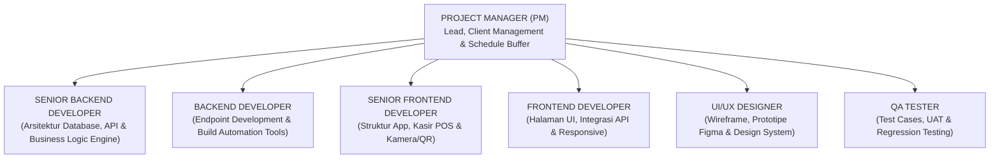

# DOKUMEN PERENCANAAN SUMBER DAYA MANUSIA, ANGGARAN, DAN JADWAL PROYEK
# SISTEM INFORMASI MANAJEMEN RENTAL IPHONE (NORIZ)

**Mata Kuliah:** Manajemen Proyek Teknologi Informasi  
**Peran:** Project Manager (PM)  
**Nama Proyek:** Rancang Bangun Sistem Informasi Manajemen Rental iPhone (NORIZ)  
**Klien:** Pengelola / Pemilik Usaha Rental iPhone  

---

## 1. EXECUTIVE SUMMARY & LATAR BELAKANG PROYEK

Sebagai seorang **Project Manager (PM)**, tugas utama saya adalah memastikan proyek pengembangan sistem **NORIZ** ini berhasil diselesaikan sesuai dengan **Triple Constraints** manajemen proyek:
1. **Scope (Ruang Lingkup):** Memenuhi seluruh spesifikasi 3 pilar modul (Data Master, Transaksi Gerai Anti-Fraud, dan Monitoring) sesuai dokumen acuan spesifikasi bisnis.
2. **Time (Waktu):** Menyelesaikan proyek tepat waktu dalam durasi kontrak **3 bulan (12 minggu)** dengan menerapkan strategi cadangan waktu (*contingency buffer*).
3. **Cost (Biaya):** Mengelola total anggaran kontrak sebesar **Rp 120.000.000,-** secara efisien sehingga menghasilkan margin laba bersih manajemen (*PM net profit*) yang optimal.

---

## 2. STRATEGI RAHASIA MANAJEMEN WAKTU: TEKNIK 2 + 1 BULAN (CRITICAL CHAIN BUFFER)

Untuk mengantisipasi dinamika riil proyek perangkat lunak (developer yang malas, *stuck* karena kesulitan teknis, anggota tim sakit, pergantian personil, hingga keterlambatan feedback klien), saya menerapkan **Strategi 2 + 1 Bulan**:

```
TOTAL KONTRAK KLIEN: 3 BULAN (12 MINGGU)
┌───────────────────────────────────────────────────┬─────────────────────────┐
│       TARGET INTERNAL TIM (2 BULAN / 8 MINGGU)     │ BUFFER PM (1 BULAN / 4 M)│
│  Sprint Pengembangan Aktif & Testing Internal     │ UAT Klien, Bugfix, Pilot│
└───────────────────────────────────────────────────┴─────────────────────────┘
 Minggu 1  ------------------------------> Minggu 8    Minggu 9 ---------> M-12
 (Tim diberitahu deadline proyek di M-8)             (Waktu 'Main Aman' PM)
```

* **Komunikasi ke Tim (Internal Deadline):** Tim diberitahu bahwa proyek **wajib selesai tuntas (Code Freeze & QA Pass) dalam waktu 2 bulan (8 minggu)**. Bonus performa dijanjikan jika tim berhasil mencapai target ini.
* **Fungsi Waktu Buffer 1 Bulan (Minggu 9–12):**
  - Mengatasi risiko *Parkinson’s Law* (kecenderungan programmer menunda pekerjaan jika diberi waktu terlalu longgar).
  - Mengakomodasi perbaikan *bug* kompleks hasil pengujian lapangan (*User Acceptance Testing*).
  - Memberikan ruang adaptasi jika ada salah satu anggota tim berkinerja buruk sehingga tugasnya harus diambil alih atau didampingi.
  - Pelatihan (*training*) staf kasir, input data armada fisik awal (IMEI & Serial Number), dan *pilot project* di gerai fisik tanpa terburu-buru.

---

## 3. STRUKTUR TIM, PERAN, DAN ALOKASI GAJI

Proyek ini menggunakan pendekatan **Lean Agile Team (Tim Ramping Berkemampuan Tinggi)** yang terdiri dari **7 orang** (termasuk Project Manager): 2 *Backend Developer*, 2 *Frontend Developer*, 1 *UI/UX Designer*, dan 1 *QA Tester*. Skema gaji mengacu pada kisaran referensi UMK Semarang (Rp 4.000.000 – Rp 6.000.000 per bulan) dengan pembagian jenjang Senior (Rp 6 juta) dan Junior/Middle (Rp 4 – 4,5 juta). Tim multi-peran dipilih agar tiap fungsi (desain, coding, dan pengujian) ditangani spesialisnya masing-masing, sehingga kualitas antar fase pembangunan tetap terjaga.



### Rincian Peran & Tanggung Jawab

| No | Posisi / Peran | Kualifikasi & Tanggung Jawab Utama | Skema Kompensasi (2 Bulan Kerja Aktif) | Total Biaya SDM |
|---|---|---|---|---|
| 1 | **Project Manager (PM)** *(Saya Sendiri)* | • Manajemen kontrak, ruang lingkup, dan ekspektasi klien.<br>• Kontrol alur kerja harian (Daily Standup) dan mitigasi risiko tim.<br>• Pengendali *timeline*, rilis modul, dan negosiasi termin pembayaran. | Mengambil keuntungan bersih proyek (*Management Fee & Net Profit*) pasca-operasional. | *(Dihitung di Bagian Profit PM)* |
| 2 | **Senior Backend Developer** (1 Orang) | • Merancang skema relasi database (PostgreSQL/MySQL).<br>• Membangun RESTful API performa tinggi & aman.<br>• Mengimplementasikan logika bisnis kompleks: kalkulator denda *overtime*, anti-bentrok reservasi, validasi IMEI fisik, dan modul *data wiping*. | Gaji Pokok: Rp 6.000.000 / bln $\times$ 2 bulan<br>+ Bonus On-Time: Rp 1.000.000,- | **Rp 13.000.000,-** |
| 3 | **Backend Developer** (1 Orang) | • Mendukung pengembangan endpoint CRUD katalog, inventaris, dan penyewa.<br>• Membangun *build automation tools* (scheduler deteksi denda, auto-cancel invoice).<br>• Review kode, dokumentasi API (Postman/Swagger), dan konfigurasi server. | Gaji Pokok: Rp 4.000.000 / bln $\times$ 2 bulan<br>+ Bonus On-Time: Rp 1.000.000,- | **Rp 9.000.000,-** |
| 4 | **Senior Frontend Developer** (1 Orang) | • Membangun struktur aplikasi web responsif (Next.js / Vue + Tailwind).<br>• Memimpin pengembangan modul kasir POS dan fitur kamera/QR scan.<br>• Mengawal integrasi API backend ke seluruh halaman dan memastikan performa UI. | Gaji Pokok: Rp 6.000.000 / bln $\times$ 2 bulan<br>+ Bonus On-Time: Rp 1.000.000,- | **Rp 13.000.000,-** |
| 5 | **Frontend Developer** (1 Orang) | • Mengimplementasikan halaman UI katalog, formulir pemesanan, dan dashboard admin.<br>• Mengintegrasikan API ke modul reservasi & monitoring.<br>• Optimasi kecepatan muat halaman (*caching*) dan konsistensi komponen responsif. | Gaji Pokok: Rp 4.000.000 / bln $\times$ 2 bulan<br>+ Bonus On-Time: Rp 1.000.000,- | **Rp 9.000.000,-** |
| 6 | **UI/UX Designer** (1 Orang) | • Riset alur pengguna (reservasi, kasir gerai, ops teknisi).<br>• Wireframe & prototipe Hi-Fi Figma, *Design System* untuk seluruh halaman.<br>• Desain template cetak Kontrak Sewa & Berita Acara Serah Terima (BAST). | Gaji Pokok: Rp 4.500.000 / bln $\times$ 2 bulan<br>+ Bonus On-Time: Rp 1.000.000,- | **Rp 10.000.000,-** |
| 7 | **QA Tester** (1 Orang) | • Menyusun *Master Test Plan* & *test case* tiap modul.<br>• Uji fungsionalitas, uji beban, dan validasi *anti-fraud* (NFC, liveness, 1-to-1 match).<br>• *Regression testing*, penyusunan Berita Acara UAT, dan *bug tracking log*. | Gaji Pokok: Rp 4.000.000 / bln $\times$ 2 bulan<br>+ Bonus On-Time: Rp 1.000.000,- | **Rp 9.000.000,-** |
| | **TOTAL ALOKASI BIAYA SDM TIM** | | | **Rp 63.000.000,-** |

---

## 4. ANGGARAN OPERASIONAL & BIAYA NON-SDM (OVERHEAD & OPEX)

Selain kompensasi tim developer, dialokasikan dana untuk kebutuhan infrastruktur server, perangkat pengujian gerai, dan dana darurat:

| No | Komponen Pengeluaran | Deskripsi & Alokasi Kebutuhan | Estimasi Biaya |
|---|---|---|---|
| 1 | **Cloud VPS & Database Server** | Sewa Cloud Server (DigitalOcean / AWS LightSail / Niagahoster VPS) spek 2 vCPU, 4GB RAM, SSD NVMe untuk durasi 1 tahun pertama operasional sistem. | Rp 2.400.000,- |
| 2 | **Domain Bisnis & Sertifikat SSL** | Pembelian domain resmi (.id / .com) untuk sistem NORIZ + SSL Wildcard 1 tahun untuk keamanan transmisi data perbankan & identitas. | Rp 350.000,- |
| 3 | **Layanan Third-Party API & Integrasi** | Biaya saldo awal WhatsApp Gateway API (notifikasi tagihan & OTP) serta integrasi sandbox/production Payment Gateway (Midtrans/Xendit). | Rp 1.250.000,- |
| 4 | **Pengadaan Hardware Uji Gerai** | Pengadaan 1 unit *USB NFC Smart Card Reader* (untuk uji coba baca chip e-KTP) dan 1 unit senter UV mini gerai. | Rp 500.000,- |
| 5 | **Operasional Rapat & Koordinasi Tim** | Biaya konsumsi rapat rutin tim, kuota internet koordinasi, dan transportasi kunjungan ke lokasi gerai fisik rental. | Rp 1.500.000,- |
| 6 | **Dana Cadangan Tak Terduga (Contingency Fund)** | Alokasi dana darurat (~4% dari total proyek) untuk mengantisipasi lonjakan beban tak terduga atau biaya sertifikasi. | Rp 3.000.000,- |
| | **TOTAL BIAYA OPERASIONAL & INFRASTRUKTUR** | | **Rp 9.000.000,-** |

---

## 5. ANALISIS KEUANGAN & POTENSI KEUNTUNGAN BERSIH PROJECT MANAGER (PM PROFIT)

Kalkulasi finansial proyek disusun secara transparan menggunakan prinsip akuntansi manajemen proyek:

$$\text{Keuntungan Bersih PM} = \text{Nilai Kontrak Klien} - (\text{Total Biaya SDM} + \text{Total Biaya Operasional})$$

$$\text{Keuntungan Bersih PM} = \text{Rp } 120.000.000 - (\text{Rp } 63.000.000 + \text{Rp } 9.000.000)$$

$$\text{Keuntungan Bersih PM} = \text{Rp } 120.000.000 - \text{Rp } 72.000.000 = \mathbf{Rp\ 48.000.000,-}$$

### Indikator Finansial Proyek:
* **Gross Profit Margin Proyek:** **40.0%** (Sangat sehat dan menguntungkan untuk standar proyek software UKM/Enterprise).
* **Rata-Rata Penghasilan Bersih PM:** **Rp 16.000.000,- per bulan** selama masa proyek 3 bulan.
* **Potensi Dana Tambahan:** Jika *Contingency Fund* (Rp 3.000.000) tidak terpakai hingga akhir proyek, maka sisa dana tersebut dapat langsung dialihkan menjadi laba tambahan bagi PM (Total Profit Maksimal: **Rp 51.000.000,-**).

---

## 6. RENCANA KERJA DETAIL (WORK BREAKDOWN STRUCTURE) DARI HARI PERTAMA SAMPAI TERAKHIR

Berikut adalah jadwal kerja kronologis seluruh anggota tim dari **Hari ke-1 (Minggu 1)** hingga **Hari Terakhir (Minggu 12)**:

### FASE 1: INISIASI, DESAIN UI/UX & ARSITEKTUR SISTEM (Minggu 1 – 2)
*Target: Dokumen PRD selesai, arsitektur database matang, prototipe Figma disetujui klien.*

* **Project Manager (PM):**
  - Memimpin Kick-Off Meeting bersama pemilik usaha rental iPhone untuk memvalidasi dokumen spesifikasi aturan bisnis NORIZ.
  - Memperkenalkan skema kerja internal 8 minggu ke tim dan menetapkan KPI masing-masing anggota.
  - Membuat papan tugas sprint di Trello / Jira / GitHub Projects.
* **UI/UX Designer:**
  - Menyusun *User Flow* perjalanan pelanggan (reservasi online) dan kasir gerai (uji KTP, BAST serah terima, check-in pengembalian).
  - Mendesain wireframe dan prototipe Hi-Fi Figma mencakup antarmuka web pelanggan dan dashboard POS kasir.
* **Backend Developer (Senior & Junior):**
  - Merancang *Entity Relationship Diagram* (ERD) dan skema database PostgreSQL (Tabel Customer, Unit, Booking, Payment, Penalty, WipingLog).
  - Menyiapkan arsitektur boilerplate API (Node.js / Laravel / Golang), autentikasi JWT, dan struktur folder.
* **Frontend Developer (Senior & Junior):**
  - Setup repository project frontend, instalasi pustaka komponen UI (Tailwind CSS, Icons, Chart.js).
  - Membuat komponen dasar (*design tokens*): tombol, modal, input form, dan layout navigasi.

---

### FASE 2: SPRINT 1 – CORE MASTER DATA & MODUL RESERVASI (Minggu 3 – 4)
*Target: Modul Master Unit, Pendaftaran Penyewa, dan Reservasi Anti-Bentrok selesai terintegrasi.*

* **Project Manager (PM):**
  - Memimpin *Daily Standup* (15 menit tiap pagi) untuk mendeteksi *blocker* coding sejak dini.
  - Melakukan review termin 1 dengan klien (progres 30%) untuk pencairan dana termin pertama.
* **UI/UX Designer & QA Tester (Peran Terpisah):**
  - Menyelesaikan panduan aset desain (*Design System*) untuk developer.
  - Mulai menyusun *Master Test Plan* dan matriks skenario uji coba (*Test Cases*) untuk validasi KTP dan reservasi.
* **Backend Developer (Senior & Junior):**
  - Membangun CRUD Master Produk (Katalog Model) dan Inventaris Fisik Unit (IMEI, Serial Number, BH %, Status).
  - Mengembangkan algoritma *Anti-Collision Schedule* pada Modul Reservasi (mencegah bentrok jadwal & menambahkan *buffer time* pembersihan 2 jam).
  - Mengembangkan endpoint pendaftaran pelanggan & upload berkas jaminan.
* **Frontend Developer (Senior & Junior):**
  - Mengimplementasikan tampilan katalog iPhone publik beserta filter model, kapasitas memori, dan durasi sewa.
  - Membangun antarmuka formulir pemesanan tanggal sewa interaktif dengan indikator ketersediaan unit *real-time*.

---

### FASE 3: SPRINT 2 – TRANSAKSI GERAI, ANTI-FRAUD & KONTRAK DIGITAL (Minggu 5 – 6)
*Target: Modul Pembayaran, Verifikasi KTP Fisik Gerai, dan BAST Serah Terima selesai.*

* **Project Manager (PM):**
  - Mengawal pengadaan alat uji hardware NFC dan senter UV di gerai rental.
  - Memastikan integrasi payment gateway berjalan sesuai standar kepatuhan regulasi finansial.
* **UI/UX Designer & QA Tester (Peran Terpisah):**
  - Melakukan pengujian fungsional modul reservasi di berbagai ukuran layar (*responsiveness test*).
  - Mendesain template tata letak cetak digital untuk Kontrak Sewa dan Berita Acara Serah Terima (BAST).
* **Backend Developer (Senior & Junior):**
  - Mengintegrasikan API Payment Gateway (notifikasi webhook pembayaran lunas otomatis).
  - Membangun modul verifikasi anti-fraud: pencatatan nomor slot loker brankas, validasi rekening 1-to-1 match, dan modul skema pelajar (verifikasi data orang tua).
  - Membuat *engine* pembuat dokumen PDF otomatis untuk Kontrak Sewa Digital dan BAST Serah Terima ber-QR Code.
* **Frontend Developer (Senior & Junior):**
  - Membangun dashboard kasir POS gerai: fitur input hasil scan chip NFC e-KTP dan status loker penyimpanan jaminan.
  - Mengintegrasikan modul kamera gawai untuk dokumentasi foto fisik unit 4 sisi saat serah terima di meja konter gerai.

---

### FASE 4: SPRINT 3 – PENGEMBALIAN, DENDA OTOMATIS & DATA WIPING (Minggu 7 – 8)
*Target: Seluruh fitur sistem tuntas (INTERNAL CODE FREEZE) pada akhir Minggu ke-8.*

* **Project Manager (PM):**
  - Mengumumkan **Internal Code Freeze** di akhir Minggu 8.
  - Memberikan evaluasi performa kerja tim dan menyiapkan bonus on-time bagi developer.
* **Backend Developer (Senior & Junior):**
  - Membangun modul *Check-In* pengembalian dan formula otomatis kalkulator denda *overtime* per jam.
  - Mengembangkan tabel katalog biaya kerusakan suku cadang fisik dan modul penahanan dokumen jaminan.
  - Membuat modul pencatatan audit trail pembersihan data pribadi (*Factory Reset & Data Wiping Log*).
  - Menyelesaikan query pelaporan agregat (omzet kas, utilisasi armada, riwayat baterai, dan blacklist).
* **Frontend Developer (Senior & Junior):**
  - Membangun form inspeksi pengembalian di dashboard kasir (komparasi foto baseline awal vs foto kembali).
  - Membangun layar pelaporan manajerial (tabel data transaksi, grafik omzet, filter tanggal).
  - Menyelesaikan integrasi tampilan *checklist sanitasi/reset* unit bagi teknisi gerai.
* **UI/UX Designer & QA Tester (Peran Terpisah):**
  - Melakukan pengujian menyeluruh (*End-to-End Testing*) dari pendaftaran $\rightarrow$ reservasi $\rightarrow$ serah terima $\rightarrow$ pengembalian $\rightarrow$ denda.
  - Mencatat daftar cacat sistem (*bug tracking log*) untuk diselesaikan developer.

---

### FASE 5: BUFFER PM 1 – UAT INTENSIF & PERBAIKAN BUG LAPANGAN (Minggu 9 – 10)
*Target: Sistem diuji coba langsung oleh staf gerai dan pemilik rental tanpa bug kritis.*

* **Project Manager (PM):**
  - Mengundang pemilik usaha rental dan staf kasir untuk sesi **User Acceptance Testing (UAT)** resmi.
  - Mengontrol permintaan fitur baru dari klien (*scope creep*) agar tidak melenceng dari kesepakatan kontrak awal.
  - Memanfaatkan cadangan waktu untuk memperbaiki hal-hal tak terduga dengan tenang.
* **Tim Developer (Backend & Frontend):**
  - Fokus menyelesaikan *bug fix* dari hasil temuan pengujian staf gerai.
  - Melakukan optimalisasi performa query database dan kecepatan memuat halaman (*caching*).
* **QA Tester:**
  - Memvalidasi ulang setiap tiket bug yang telah diperbaiki developer (*regression testing*).
  - Menyusun dokumen Berita Acara UAT untuk ditandatangani oleh klien.

---

### FASE 6: BUFFER PM 2 – DEPLOYMENT, TRAINING, & HANDOVER RESMI (Minggu 11 – 12)
*Target: Sistem live di server produksi, staf terlatih, serah terima tuntas, dan pembayaran 100% cair.*

* **Project Manager (PM):**
  - Mengawal migrasi sistem ke server *Production* resmi NORIZ.
  - Mengawasi proses *Go-Live* operasional gerai pada hari pertama.
  - Menandatangani Berita Acara Serah Terima (BAST) Proyek Akhir bersama klien.
  - Melakukan penagihan termin pelunasan kontrak (100% lunas) dan mendistribusikan honor/bonus tim.
* **Backend Developer (Senior & Junior):**
  - Konfigurasi server produksi, setup domain resmi, instalasi SSL HTTPS, dan konfigurasi pencadangan database berkala (*auto-backup* harian).
* **Frontend Developer (Senior & Junior):**
  - Final build & bundle aplikasi web di CDN/server produksi, serta memastikan semua kamera tablet/laptop gerai berfungsi lancar.
* **UI/UX Designer & QA Tester (Peran Terpisah):**
  - Menyusun **Buku Panduan Pengguna (User Manual Guide)** dalam format PDF untuk kasir, teknisi, dan pemilik rental.
  - Bersama PM memberikan sesi pelatihan (*Training*) kepada seluruh staf operasional gerai rental iPhone.

---

## 7. MATRIKS RISIKO & MITIGASI MASALAH TIM (PM RISK MANAGEMENT)

| Skenario Risiko Lapangan | Probabilitas | Dampak | Tindakan Mitigasi yang Dilakukan PM |
|---|---|---|---|
| **Programmer Malas / Pasif Menjelang Deadline** | Sedang | Tinggi | Terapkan *daily standup* 15 menit via Discord/Google Meet. Pecah tugas menjadi tiket kecil (maksimal 1–2 hari kerja). Jika macet $\ge 2$ hari, PM langsung intervensi atau mendampingi secara teknis. |
| **Programmer Sakit / Resign Mendadak** | Rendah | Tinggi | Sistem dikerjakan menggunakan standar arsitektur dan dokumentasi API yang rapi di Postman/Swagger. Cadangan waktu 4 minggu (Buffer) menjamin ada waktu cukup untuk mendelegasikan tugas atau merekrut tenaga lepas pengganti tanpa panik. |
| **Klien Meminta Tambahan Fitur di Tengah Jalan (*Scope Creep*)** | Tinggi | Sedang | PM menggunakan dokumen spesifikasi bisnis NORIZ sebagai pegangan hukum. Tambahan fitur di luar kontrak dialihkan ke "Fase 2 Pengembangan" pasca-pelunasan proyek utama. |
| **UAT Menemukan Banyak Bug di Gerai** | Sedang | Sedang | Telah dialokasikan waktu khusus selama 2 minggu di Fase Buffer (Minggu 9–10) khusus untuk uji coba lapangan, sehingga jadwal rilis resmi klien tidak terganggu sama sekali. |